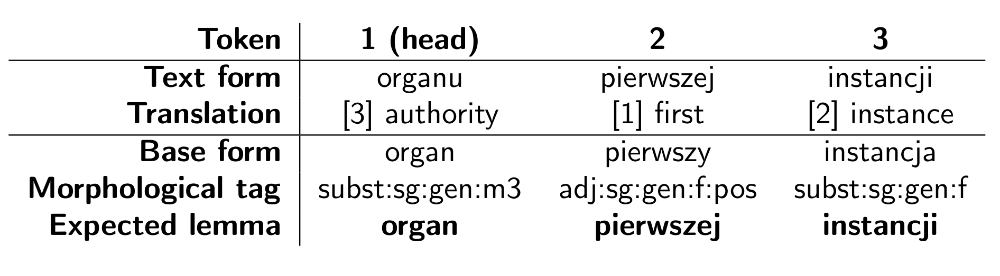

Polem
=====
Polem is a tool for text phrase lemmatization for Polish language. 
It was designed to lemmatize multi-word common noun phrases and named entities. 





Build
=====


### Docker

```
docker build . -t polem
```

Test

```
docker run -it polem python3.6 pythonwrap/polem_test.py
```

Expected output:
```
Orths : Lidze światowej
Lemmas: liga światowy
Tags  : subst:sg:loc:f adj:sg:loc:f:pos
Phrase lemma: liga światowa
```

### Local installation

[Instruction](docs/local-installation.docs)

Cmd usage
---------
```bash
polem -h
```

```bash
Parameters:
  -h [ --help ]             Print help message
  -p [ --pathname ] arg     Pathname to input file - REQUIRED
  -f [ --files ] arg        Full pathname to data files for lemmatizer, 
                            required when lemmatizer is not installed
  -t [ --tagset ] arg       Tagset to use (Currently only NKJP)- OPTIONAL
  -c [ --case-sensitive ]   Case sensitive evaluation - OPTIONAL
  -s [ --space-sensitive ]  Whitespace sensitive evaluation - OPTIONAL
  -d [ --debug ]            Additional debug prints
```

Benchmark
---------

```
docker run -it polem polem -p /build/polem/corpus/kpwr-1.1-fixed-keywords-test.txt
```

The `./corpus/` folder contains train and test sets. To evaluate the Polem lemmatization model on the gold standard data, run the following command:

```bash
polem -p corpus/kpwr-1.1-fixed-keywords-test.txt
```

Output:
```bash
(skipped)
[ 994]	True	XV BK	XV BK	xv bk		RuleLemmatizer:SubstAdj_Flex-0	xv bk 	adj:sg:nom:m3:pos subst:sg:nom:m3
[ 995]	True	Copyright Alliance	copyright Alliance	copyright alliance		RuleLemmatizer:SubstSubst_Agr12-nmb-gnd-cas-0	copyright alliance 	subst:sg:nom:m3 subst:sg:nom:m3
[ 996]	True	Nierozsądne śluby	nierozsądne śluby	nierozsądne śluby		RuleLemmatizer:SubstAdj_Flex-0	nierozsądny ślub 	adj:pl:nom:m3:pos subst:pl:nom:m3
[ 997]	False	Stacje telewizyjne	stacje telewizyjne	stacja telewizyjna		RuleLemmatizer:SubstAdj_Agr12-nmb-gnd-cas-0	stacja telewizyjny 	subst:pl:nom:f adj:pl:nom:f:pos
[ 998]	True	Prawo budowlane	prawo budowlane	prawo budowlane		RuleLemmatizer:SubstAdj_Agr12-nmb-gnd-cas-0	prawo budowlany 	subst:sg:nom:n adj:sg:nom:n:pos
[ 999]	True	gminy żydowskiej	gmina żydowska	gmina żydowska		RuleLemmatizer:SubstAdj_Agr12-nmb-gnd-cas-0	gmina żydowski 	subst:sg:gen:f adj:sg:gen:f:pos
[1000]	True	Turniej finałowy	turniej finałowy	turniej finałowy		RuleLemmatizer:SubstAdj_Agr12-nmb-gnd-cas-0	turniej finałowy 	subst:sg:nom:m3 adj:sg:nom:m3:pos
------------------------------------------------------------
# Evaluation by method
%------------------------------------------------------------
\hline
 True & False &    Acc & Method                         & Coverage \\
%------------------------------------------------------------
\hline
   43 &     6 &  87.76\% & OrthLemmatizer                 &   4.67\% \\
   12 &     0 & 100.00\% & RuleLemmatizer:AdjSubstAdj\_Agr123-nmb-gnd-cas-0 &   1.18\% \\
    6 &     0 & 100.00\% & RuleLemmatizer:AdjSubstSubst\_Gen-0 &   0.60\% \\
    8 &     1 &  88.89\% & RuleLemmatizer:AdjSubstTail-0  &   0.89\% \\
    3 &     0 & 100.00\% & RuleLemmatizer:Num2-0          &   0.30\% \\
    9 &     1 &  90.00\% & RuleLemmatizer:Num3-0          &   0.99\% \\
    1 &     0 & 100.00\% & RuleLemmatizer:NumAndNum-0     &   0.10\% \\
    1 &     0 & 100.00\% & RuleLemmatizer:SubstAdjAdjFlex-0 &   0.10\% \\
    1 &     0 & 100.00\% & RuleLemmatizer:SubstAdjSubstAdj\_Gen-0 &   0.10\% \\
    8 &     0 & 100.00\% & RuleLemmatizer:SubstAdjSubst\_Agr12-nmb-gnd-cas-0 &   0.79\% \\
    1 &     0 & 100.00\% & RuleLemmatizer:SubstAdjSubst\_Agr123case-0 &   0.10\% \\
    6 &     0 & 100.00\% & RuleLemmatizer:SubstAdjSubst\_Agr23-nmb-ger-cas-0 &   0.60\% \\
   36 &     8 &  81.82\% & RuleLemmatizer:SubstAdjTail-0  &   4.21\% \\
    2 &     0 & 100.00\% & RuleLemmatizer:SubstAdj\_Agr12-nmb-cas\_Sg\_FixGndN-0 &   0.20\% \\
  232 &    37 &  86.25\% & RuleLemmatizer:SubstAdj\_Agr12-nmb-gnd-cas-0 &  21.18\% \\
   42 &     1 &  97.67\% & RuleLemmatizer:SubstAdj\_Flex-0 &   4.12\% \\
    2 &     3 &  40.00\% & RuleLemmatizer:SubstAdj\_SgPl\_FixNmbPl-0 &   0.50\% \\
    8 &     2 &  80.00\% & RuleLemmatizer:SubstAndSubs-0  &   0.99\% \\
    1 &     0 & 100.00\% & RuleLemmatizer:SubstAndSubstAdj\_Agr134-nmb-gnd-cas-0 &   0.10\% \\
    6 &     4 &  60.00\% & RuleLemmatizer:SubstHyphenSubst-0 &   0.99\% \\
   26 &     3 &  89.66\% & RuleLemmatizer:SubstSubstAdj-0 &   2.82\% \\
   19 &     0 & 100.00\% & RuleLemmatizer:SubstSubstSubst\_GenGen-0 &   1.86\% \\
  142 &     6 &  95.95\% & RuleLemmatizer:SubstSubst\_Agr12-nmb-gnd-cas-0 &  12.88\% \\
  123 &    12 &  91.11\% & RuleLemmatizer:SubstSubst\_GenSg\_Fix-0 &  11.88\% \\
    4 &    11 &  26.67\% & RuleLemmatizer:SubstSubst\_Gen\_Fix-0 &   1.48\% \\
  140 &    23 &  85.89\% & RuleLemmatizer:SubstTail-0     &  14.00\% \\
------------------------------------------------------------
# Evaluation by method
%------------------------------------------------------------
\hline
 True & False &    Acc & Method                         & Coverage \\
%------------------------------------------------------------
\hline
   43 &     6 &  87.76\% & OrthLemmatizer                 &   4.90\% \\
  839 &   112 &  88.22\% & RuleLemmatizer                 &  95.00\% \\
%------------------------------------------------------------
\hline
  882 &   118 &  88.20\% & Total                          \\
%------------------------------------------------------------
\hline
------------------------------------------------------------
# Evaluation by keyword category
%------------------------------------------------------------
\hline
 True & False &    Acc & Method                         & Coverage \\
%------------------------------------------------------------
\hline
  882 &   118 &  88.20\% & none                           &  99.90\% \\
%------------------------------------------------------------
\hline
  882 &   118 &  88.20\% & Total                          \\
%------------------------------------------------------------

```

Publication
-----------

More information about the algorithm can be found in the following article:

```bibtex
@inproceedings{DBLP:conf/ranlp/Marcinczuk17,
  author    = {Michal Marcinczuk},
  editor    = {Ruslan Mitkov and
               Galia Angelova},
  title     = {Lemmatization of Multi-word Common Noun Phrases and Named Entities
               in Polish},
  booktitle = {Proceedings of the International Conference Recent Advances in Natural
               Language Processing, {RANLP} 2017, Varna, Bulgaria, September 2 -
               8, 2017},
  pages     = {483--491},
  publisher = {{INCOMA} Ltd.},
  year      = {2017},
  url       = {https://doi.org/10.26615/978-954-452-049-6_064},
  doi       = {10.26615/978-954-452-049-6_064},
  timestamp = {Tue, 09 Jan 2018 14:09:59 +0100},
  biburl    = {http://dblp.org/rec/bib/conf/ranlp/Marcinczuk17},
  bibsource = {dblp computer science bibliography, http://dblp.org}
}
```
[Presentation](https://www.researchgate.net/publication/332369593_Lemmatization_of_Multi-word_Common_Noun_Phrases_and_Named_Entities_in_Polish)

Contributors
-------------
* Michał Marcińczuk <marcinczuk@gmail.com>
* Grzegorz Kuboń

Acknowledgments
---------------
Work financed as part of the investment in the CLARIN-PL research infrastructure funded by the Polish Ministry of Science and Higher Education


License
-------
Copyright (C) Wrocław University of Science and Technology (PWr), 2017-2018. 
Grzegorz Kuboń, Michał Marcińczuk.

This program is free software: you can redistribute it and/or modify
it under the terms of the GNU General Public License as published by
the Free Software Foundation, either version 3 of the License, or
(at your option) any later version.

This program is distributed in the hope that it will be useful,
but WITHOUT ANY WARRANTY; without even the implied warranty of
MERCHANTABILITY or FITNESS FOR A PARTICULAR PURPOSE.  See the
GNU General Public License for more details.

You should have received a copy of the GNU General Public License
along with this program.  If not, see <<http://www.gnu.org/licenses/>>.

